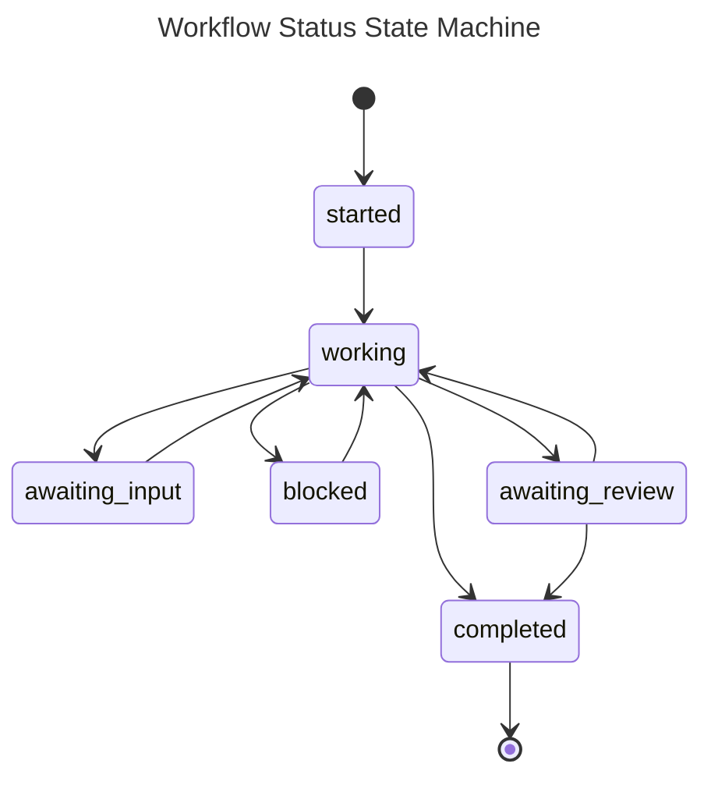

# Agent Status Toolkit

The Agent Status Toolkit is the "workflow spine" for Bob-managed agent sessions: it lets OpenCode (and compatible) agents report progress, request human input with a timeout, and keep PR/task context in sync across Bob's UI and Kanbanger.

It exists to solve a practical problem in multi-agent/multi-worktree development: humans need **reliable visibility** into what an agent is doing, and agents need a **structured way** to pause for decisions (without deadlocking) and then resume.

---

## Overview

**What it does**

- Provides a **workflow state machine** per session (e.g., `working`, `awaiting_input`, `blocked`, `awaiting_review`, `completed`)
- Exposes **17 MCP tools** via `@bob/mcp-server` for status reporting, PR operations, and Kanbanger task integration
- Enables humans to resolve "awaiting input" via:
  - Bob UI (interactive cards)
  - Kanbanger comments (webhook-driven resolution)
  - Automatic timeout expiry (cron route)

**Why it exists**

- Keeps agent work legible: "What is it doing? Why is it stuck? What do I need to answer?"
- Prevents "silent failures" and long-running uncertainty by enforcing explicit states and transitions
- Connects session context (repo/worktree/task/PR) so tooling can stay session-scoped

---

## Architecture

### High-level flow

```mermaid
---
title: Agent Status Toolkit - Components
---
graph TB
  Agent[OpenCode Agent] -->|MCP tools| MCP[@bob/mcp-server (stdio)]
  MCP -->|tRPC calls| API[@bob/api (tRPC router)]
  API -->|read/write| DB[(Database)]
  DB -->|session events| Gateway[Gateway WebSocket]
  Gateway -->|state/events| UI[Bob Next.js UI]

  Kanbanger[Kanbanger] -->|webhook: task/comment| Webhook[/apps/nextjs/api/webhooks/kanbanger/]
  Webhook -->|resolve awaiting input| DB

  Cron[/apps/nextjs/api/cron/awaiting-input-expiry/] -->|resolve timeouts| DB
  Cron -->|optional comment| Kanbanger
```

### Components (where to look)

**Database / session state**

- Workflow and awaiting-input fields are stored on the session record and emitted via session events.
- Core state logic lives in `packages/api/src/services/sessions/workflowStatusService.ts`.

**tRPC endpoints (Bob API)**

- Session workflow endpoints live in `packages/api/src/router/session.ts`:
  - `reportWorkflowStatus`
  - `requestInput`
  - `resolveAwaitingInput`
  - `getWorkflowState`

**MCP server**

- MCP tools are implemented in `packages/mcp-server/src/tools/`:
  - `status.ts` (status + input request)
  - `context.ts` (session/task/workflow/PR list)
  - `task.ts` (Kanbanger linking/commenting/completion/status)
  - `pr.ts` (PR lifecycle helpers)

**Kanbanger webhooks**

- Webhook receiver: `apps/nextjs/src/app/api/webhooks/kanbanger/route.ts`
- Supports resolving awaiting-input by detecting a matching session for the Kanbanger issue and applying a "human" resolution.

**Awaiting-input expiry**

- Cron route: `apps/nextjs/src/app/api/cron/awaiting-input-expiry/route.ts`
- Finds expired awaiting-input sessions and resolves them with a timeout resolution.

**UI components**

- Session header includes workflow badge support:
  - `apps/nextjs/src/app/chat/_components/session-header.tsx`
- Awaiting-input cards:
  - `apps/nextjs/src/app/chat/_components/awaiting-input-card.tsx`

---

## State Machine

The workflow engine is intentionally simple and explicit. It is designed to prevent confusing half-states and to make transitions safe and testable.

### Diagram



### Semantics (what each state means)

- `started`: session exists, agent has begun but not yet actively progressing
- `working`: agent is actively executing steps (should emit periodic updates)
- `awaiting_input`: agent has asked a question and is paused (until human response or timeout)
- `blocked`: agent cannot proceed (requires human intervention; should include clear reason)
- `awaiting_review`: agent has finished implementation and is waiting for human review/approval
- `completed`: terminal state; work is done

### Transition rules (important constraints)

- `awaiting_input → working` is the only path out of awaiting input
- `blocked → working` is the only path out of blocked
- `awaiting_review → completed` is allowed (e.g., after merge/approval), but `completed` is terminal
- Invalid transitions are rejected in the backend (see `workflowStatusService.ts`)

---

## MCP Tools Reference (17 tools)

All tools are **session-scoped**: they require `BOB_SESSION_ID` to be set in the MCP server environment.

### Status Tools (4)

#### Tool: `update_status`

Update your workflow status (human-visible in Bob UI; may also post to Kanbanger for key states).

**Parameters**

| Name       | Type                       | Required | Description                                                               |
| ---------- | -------------------------- | -------: | ------------------------------------------------------------------------- |
| `status`   | `"working" \| "completed"` |      Yes | Current workflow status                                                   |
| `message`  | `string`                   |      Yes | Short description of what you're doing/did                                |
| `phase`    | `string`                   |       No | Optional phase label (e.g. `"planning"`, `"implementation"`, `"testing"`) |
| `progress` | `string`                   |       No | Optional progress indicator (e.g. `"3/5 tasks"`)                          |

**Example**

```text
update_status({
  "status": "working",
  "message": "Implementing workflow UI rendering for awaiting_input",
  "phase": "implementation",
  "progress": "2/4"
})
```

---

#### Tool: `request_input`

Ask the user a question; the system waits until the user responds or until timeout, then proceeds with the default action.

**Parameters**

| Name              | Type       | Required | Description                                |
| ----------------- | ---------- | -------: | ------------------------------------------ |
| `question`        | `string`   |      Yes | The question to ask                        |
| `default_action`  | `string`   |      Yes | What to do if the user does not respond    |
| `options`         | `string[]` |       No | Suggested response options                 |
| `timeout_minutes` | `number`   |       No | Timeout in minutes (default: 30, max: 120) |

**Example**

```text
request_input({
  "question": "Should we render workflow_status 'state' events inline in the chat stream?",
  "options": ["Yes", "No (header badge only)", "Both (header + inline)"],
  "default_action": "Render in header only for now",
  "timeout_minutes": 30
})
```

---

#### Tool: `mark_blocked`

Mark the session as blocked with a clear reason and optional list of blockers.

**Parameters**

| Name       | Type       | Required | Description              |
| ---------- | ---------- | -------: | ------------------------ |
| `reason`   | `string`   |      Yes | Why the agent is blocked |
| `blockers` | `string[]` |       No | Specific blocking items  |

**Example**

```text
mark_blocked({
  "reason": "Cannot complete PR creation: repository is not linked to this session",
  "blockers": ["session.repositoryId is null", "need a session started from a worktree/repo"]
})
```

---

#### Tool: `submit_for_review`

Mark work as ready for review and attach PR metadata to the workflow status details.

**Parameters**

| Name                 | Type     | Required | Description              |
| -------------------- | -------- | -------: | ------------------------ |
| `pr_url`             | `string` |      Yes | PR URL                   |
| `summary`            | `string` |      Yes | Summary of changes       |
| `notes_for_reviewer` | `string` |       No | Reviewer notes / context |

**Example**

```text
submit_for_review({
  "pr_url": "https://github.com/your-org/bob/pull/123",
  "summary": "Adds AwaitingInputCard rendering to chat UI and fixes workflow state parsing",
  "notes_for_reviewer": "Please focus on the workflow_status event handling and UI copy."
})
```

---

### Context Tools (4)

#### Tool: `get_session`

Fetch current session metadata (repo/worktree/agent type/working dir).

**Parameters**: none

**Example**

```text
get_session({})
```

---

#### Tool: `get_task_context`

Fetch linked Kanbanger task metadata (if any). Returns `{ hasTask: false }` if not linked.

**Parameters**: none

**Example**

```text
get_task_context({})
```

---

#### Tool: `get_workflow_state`

Fetch workflow status, message, and the active awaiting-input payload (if present).

**Parameters**: none

**Example**

```text
get_workflow_state({})
```

---

#### Tool: `list_session_prs`

List all PRs created/linked under the current session.

**Parameters**: none

**Example**

```text
list_session_prs({})
```

---

### Task Tools (4)

#### Tool: `link_task`

Link a Kanbanger task to the current session.

**Parameters**

| Name              | Type     | Required | Description                        |
| ----------------- | -------- | -------: | ---------------------------------- |
| `task_identifier` | `string` |      Yes | Task identifier (e.g. `"BOB-123"`) |

**Example**

```text
link_task({ "task_identifier": "BOB-123" })
```

---

#### Tool: `post_task_comment`

Post a Markdown comment to the linked Kanbanger task.

**Parameters**

| Name      | Type     | Required | Description                       |
| --------- | -------- | -------: | --------------------------------- |
| `comment` | `string` |      Yes | Comment body (Markdown supported) |

**Example**

```text
post_task_comment({
  "comment": "Status update: workflow UI now renders awaiting-input cards. Next: add e2e coverage."
})
```

---

#### Tool: `complete_task`

Mark the linked Kanbanger task run as complete and optionally attach a PR URL. Also reports workflow status as `completed`.

**Parameters**

| Name              | Type      | Required | Description                          |
| ----------------- | --------- | -------: | ------------------------------------ |
| `summary`         | `string`  |      Yes | Summary of what was accomplished     |
| `pr_url`          | `string`  |       No | PR URL                               |
| `mark_issue_done` | `boolean` |       No | Mark issue as done (default: `true`) |

**Example**

```text
complete_task({
  "summary": "Implemented workflow status toolkit UI integration and added Playwright e2e plan",
  "pr_url": "https://github.com/your-org/bob/pull/123",
  "mark_issue_done": true
})
```

---

#### Tool: `update_task_status`

Update the linked Kanbanger task's status.

**Parameters**

| Name     | Type                                               | Required | Description     |
| -------- | -------------------------------------------------- | -------: | --------------- |
| `status` | `"todo" \| "in_progress" \| "in_review" \| "done"` |      Yes | New task status |

**Example**

```text
update_task_status({ "status": "in_review" })
```

---

### PR Tools (5)

#### Tool: `create_pr`

Create a new PR and link it to the current session (and Kanbanger task if linked).

**Parameters**

| Name          | Type      | Required | Description                                               |
| ------------- | --------- | -------: | --------------------------------------------------------- |
| `title`       | `string`  |      Yes | PR title                                                  |
| `head_branch` | `string`  |      Yes | Source branch name                                        |
| `body`        | `string`  |       No | PR body (Markdown)                                        |
| `base_branch` | `string`  |       No | Target branch (defaults to main/master in provider layer) |
| `draft`       | `boolean` |       No | Draft PR (default: false)                                 |

**Example**

```text
create_pr({
  "title": "feat: render workflow status and awaiting input UI",
  "head_branch": "feature/agent-status-ui",
  "base_branch": "main",
  "body": "## Summary\n- Renders workflow state in session header\n- Adds awaiting-input cards\n\n## Testing\n- e2e plan added",
  "draft": true
})
```

---

#### Tool: `update_pr`

Update PR metadata or state.

**Parameters**

| Name    | Type                 | Required | Description        |
| ------- | -------------------- | -------: | ------------------ |
| `pr_id` | `string`             |      Yes | PR ID (UUID)       |
| `title` | `string`             |       No | New title          |
| `body`  | `string`             |       No | New body           |
| `state` | `"open" \| "closed"` |       No | Set PR open/closed |

**Example**

```text
update_pr({
  "pr_id": "11111111-2222-3333-4444-555555555555",
  "title": "feat: workflow status UI + awaiting input cards",
  "state": "open"
})
```

---

#### Tool: `get_pr_status`

Fetch PR details: status, URL, branches, stats, timestamps.

**Parameters**

| Name    | Type     | Required | Description  |
| ------- | -------- | -------: | ------------ |
| `pr_id` | `string` |      Yes | PR ID (UUID) |

**Example**

```text
get_pr_status({ "pr_id": "11111111-2222-3333-4444-555555555555" })
```

---

#### Tool: `merge_pr`

Merge a PR using a chosen merge method.

**Parameters**

| Name           | Type                              | Required | Description                       |
| -------------- | --------------------------------- | -------: | --------------------------------- |
| `pr_id`        | `string`                          |      Yes | PR ID (UUID)                      |
| `merge_method` | `"merge" \| "squash" \| "rebase"` |       No | Merge method (default: `"merge"`) |

**Example**

```text
merge_pr({
  "pr_id": "11111111-2222-3333-4444-555555555555",
  "merge_method": "squash"
})
```

---

#### Tool: `refresh_pr`

Refresh PR status/details from the remote provider.

**Parameters**

| Name    | Type     | Required | Description  |
| ------- | -------- | -------: | ------------ |
| `pr_id` | `string` |      Yes | PR ID (UUID) |

**Example**

```text
refresh_pr({ "pr_id": "11111111-2222-3333-4444-555555555555" })
```

---

## Integration Guide

### OpenCode integration

Use the provided config template:

- `packages/bob-agent-toolkit/src/config/opencode-config.json`

Minimal example:

```json
{
  "$schema": "https://opencode.ai/schemas/config.json",
  "mcpServers": {
    "bob": {
      "type": "stdio",
      "command": "npx",
      "args": ["@bob/mcp-server"],
      "env": {
        "BOB_API_URL": "${env:BOB_API_URL}",
        "BOB_API_KEY": "${env:BOB_API_KEY}",
        "BOB_SESSION_ID": "${env:BOB_SESSION_ID}"
      }
    }
  },
  "skills": [
    {
      "name": "bob-workflow",
      "description": "Workflow and status reporting for Bob-managed sessions",
      "path": "./skills/bob-workflow.md"
    }
  ]
}
```

### oh-my-opencode integration

Use the provided template:

- `packages/bob-agent-toolkit/src/oh-my-opencode/oh-my-opencode-config.json`

Key point: it references the packaged skill source:

```json
{
  "skills": {
    "bob-workflow": {
      "name": "bob-workflow",
      "description": "Workflow and status reporting for Bob-managed sessions",
      "source": "@bob/agent-toolkit/oh-my-opencode/bob-workflow-skill"
    }
  }
}
```

### MCP server config template (MCP spec)

- `packages/bob-agent-toolkit/src/config/mcp-config.json`

---

## UI Components

### `WorkflowStatusBadge` (in session header)

Implemented inside `apps/nextjs/src/app/chat/_components/session-header.tsx`.

**Inputs**

- `workflowState.workflowStatus`: one of
  `started | working | awaiting_input | blocked | awaiting_review | completed`
- `workflowState.statusMessage` is shown as a tooltip (`title` attribute)

**Usage**
`SessionHeader` accepts:

```ts
workflowState?: {
  workflowStatus: "started" | "working" | "awaiting_input" | "blocked" | "awaiting_review" | "completed";
  statusMessage?: string | null;
  awaitingInput?: { question: string; options?: string[] | null; defaultAction: string; expiresAt: string } | null;
} | null
```

Render it by passing `workflowState` into `SessionHeader`.

---

### `AwaitingInputCard` / `ResolvedInputCard`

Implemented in `apps/nextjs/src/app/chat/_components/awaiting-input-card.tsx`.

**AwaitingInputCard props**

- `question: string`
- `options?: string[] | null`
- `defaultAction: string`
- `expiresAt: string` (ISO timestamp)
- `onResolve?: (response: string) => void`
- `isResolving?: boolean`

**ResolvedInputCard props**

- `question: string`
- `resolution: { type: "human" | "timeout"; value: string }`

**Typical pattern**

- When `workflowState.workflowStatus === "awaiting_input"` and `workflowState.awaitingInput` exists:
  - render `AwaitingInputCard` with `onResolve` wired to a "resolve" action
- After resolution is recorded:
  - render `ResolvedInputCard` to show history (human vs timeout)

---

## Webhook Integration (Kanbanger)

Webhook endpoint:

- `POST /api/webhooks/kanbanger` (implemented in `apps/nextjs/src/app/api/webhooks/kanbanger/route.ts`)

**Headers**

- `X-Kanbanger-Event`: `"task"` or `"comment"`
- `X-Kanbanger-Signature`: optional, HMAC hex signature of the raw body

**Signature verification**

- If `KANBANGER_WEBHOOK_SECRET` is set and `X-Kanbanger-Signature` is provided:
  - the handler computes `HMAC_SHA256(secret, rawBody)` and compares hex via timing-safe comparison
  - invalid signature returns `401`

**Awaiting input resolution via comment**

- When a `comment:created` webhook arrives:
  - If there is a session linked to that Kanbanger issue where `workflow_status = 'awaiting_input'` and `awaiting_input_resolved_at` is null:
    - the comment body resolves the awaiting input and transitions the session back to `working`

---

## Configuration

### Required environment variables (MCP server)

| Name             | Required | Description                |
| ---------------- | -------: | -------------------------- |
| `BOB_API_URL`    |      Yes | Bob API base URL           |
| `BOB_API_KEY`    |      Yes | API key for authentication |
| `BOB_SESSION_ID` |      Yes | Session ID for tool calls  |

### Kanbanger integration (optional but recommended)

| Name                       | Required | Description                                                   |
| -------------------------- | -------: | ------------------------------------------------------------- |
| `KANBANGER_API_URL`        |       No | Kanbanger API base URL (default: `https://tasks.gmac.io/api`) |
| `KANBANGER_API_KEY`        |       No | API key for posting comments                                  |
| `KANBANGER_WEBHOOK_SECRET` |       No | Secret to verify webhook signatures                           |

### Awaiting-input expiry cron

Cron route:

- `GET /api/cron/awaiting-input-expiry`

| Name          | Required | Description                                            |
| ------------- | -------: | ------------------------------------------------------ |
| `CRON_SECRET` |       No | If set, requires `Authorization: Bearer <CRON_SECRET>` |

---

## Testing

The toolkit is heavily unit-tested across backend services and MCP tools.

### Run API/service tests

```bash
pnpm -F @bob/api test
pnpm -F @bob/api test:coverage
```

Relevant test files:

- `packages/api/src/services/sessions/__tests__/workflowStatusService.test.ts`
- `packages/api/src/services/sessions/__tests__/kanbangerWebhook.test.ts`
- `packages/api/src/services/sessions/__tests__/awaitingInputExpiry.test.ts`

### Run MCP server tool tests

```bash
pnpm -F @bob/mcp-server test
```

Relevant test files:

- `packages/mcp-server/src/tools/__tests__/status.test.ts`
- `packages/mcp-server/src/tools/__tests__/context.test.ts`
- `packages/mcp-server/src/tools/__tests__/task.test.ts`

---

## Troubleshooting

**Tool says session ID not set**

- Ensure `BOB_SESSION_ID` is set in the MCP server env (OpenCode config / MCP config).

**Kanbanger comments don't post**

- `KANBANGER_API_KEY` is required for outbound comments; without it, posting is skipped.

**Awaiting input never resolves**

- Confirm:
  - the session is actually in `awaiting_input`
  - webhook route is receiving `comment:created`
  - `KANBANGER_WEBHOOK_SECRET` matches the sender (if enabled)

---

## When to revisit / evolve this design

If any of these become true, consider a more advanced approach:

- You need multi-question queues per session (currently: one active awaiting-input record)
- You need role-based input resolution ("only reviewers can answer")
- You need workflow states beyond the core set (e.g., `paused`, `failed`, `cancelled`)
- You need event streaming semantics for tool results (e.g., partial progress updates)
